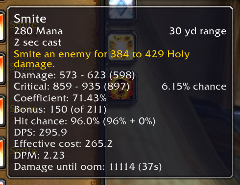
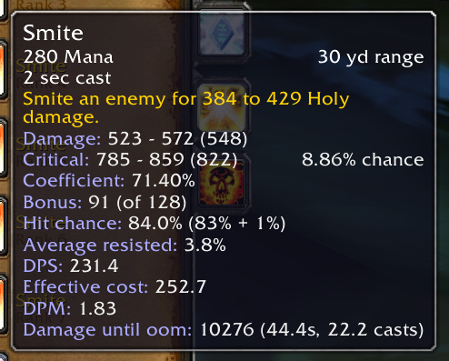
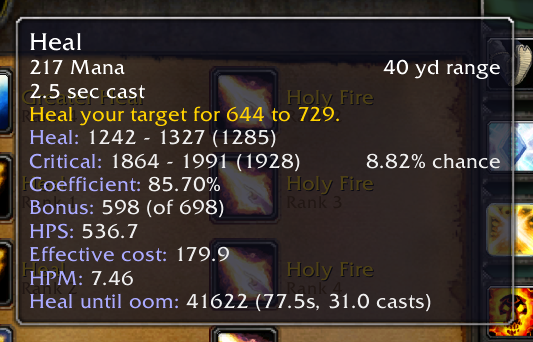

# SpellCalc

A WoW classic addon providing information for spells, like actual damage done, crit and hit chance, scaling etc.

## This is still in a somewhat alpha state

* Caster classes should all work. This includes totems and seals.
* Warrior, Hunter and Rogue have no support at all.
* Math and logic may or may not be correct for all spells/talents/buffs/items/sets. 
* Consider using `/console scriptErrors 1` when using (testing) this.

## Features that are supposed to work

* Spell power scaling.
* Crit and hit chance.
* Average damage resisted or additional miss chance for binary spells.
* Use target or set level difference for hit chance and resistance calculation.
* DPS and HPS values after all of the above.
* DPM, HPM, and done until OOM values after factoring in spirit regen (while casting), MP5 and other mana returns.
* Can show some values on the action bar.

It should be easy to add/implement missing buffs/items/talents/effects or fix incorrect ones. I just need to know what is missing or wrong.

`/sc` will show a window with all the stats used (intended for debug, it's not pretty)

`/sc debug` will toggle debug output

There is a settings menu in the interface options addons tab.

## Known Problems
* Aura crit supression for melee is always applied, even if there is no crit from auras. This means if you don't have at least 2% crit from gear, talents or buffs you will have less crit displayed against +3 targets than you have. This should rarely matter.
* Block is missing from melee attacks due to damage reduction formula being unknown to me.

## Planned
* Support for melee and ranged spells.
* Using target for debuffs (e.g. Shadow Weaving) or things like troll beast dmg, low prio.
* Resistance (custom values can be set) and armor mitigation, very low prio.

## Some examples

