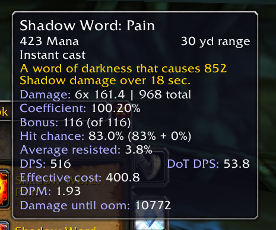

# SpellCalc

A WoW classic addon that shows information for spells, like actual damage done, crit and hit chance, scaling etc.

This is NOT a combat simulation tool. Calculated values are for the current stats of your character. Not all effects in the game are implemented. This is only meant to give you more insight than the default tooltips.

Versions starting with 0.10 are for TBC only.

## Current Features

* Scaling with bonus damage/healing.
* Crit and hit chance.
* Average damage resisted or additional miss chance for binary spells.
* DPS and HPS values after the above.
* DPM/HPM and done until OOM after factoring in current mana regen and some mana procs.
* Can show values on the action bar.
* Options menu to change tooltip and actionbar values and some calculation settings (`/sc`)

## Planned (if I ever get to it)
* Target debuffs

## Things that aren't working and probably won't in the near future

* Warrior, Hunter and Rogue have no support at all.
* Shaman, Druid and Paladin melee is also not supported.
* Paladin seals are included, but the values are off for SoB and SoV. Also
* Melee math (used for auto attacks and paladin seals) probably has problems.

## Some old examples

